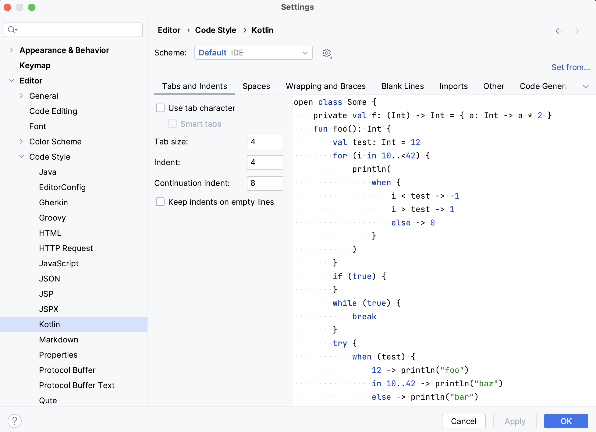

IntelliJ IDEA ofrece dos maneras de cumplir con las guías de estilo de código del proyecto: **_esquemas de código_** y **_configs de editor_**. En esta lección, hablaremos de ambos.

### Esquemas de código

Hay dos esquemas de código predefinidos:

- **Esquema de proyecto**: configuras ajustes para un proyecto específico, se almacenan en la carpeta codeStyles bajo **.idea** y se comparten a través del VCS junto con el proyecto.
- **Esquema por defecto**: configuras los ajustes que se podrían aplicar a todos los proyectos en los que trabajas en el IDE que tienen el esquema Predeterminado seleccionado.

Ten en cuenta que los esquemas de código son específicos de cada lenguaje.

Para configurar el **esquema de código**,
1. Presiona `⌘,` (macOS) o `Ctrl+Alt+S` (Linux/Windows) para abrir la configuración del IDE y selecciona Editor | Estilo de Código.
2. Selecciona el lenguaje de programación `Kotlin`.
3. Selecciona el esquema de código que te gustaría configurar (Proyecto o Predeterminado).
4. Configura los ajustes de estilo de código, tales como pestañas y sangrías, ajustes de importación (usando importación de nombre único o importación con `*`), y muchos otros.

    

### EditorConfig

Otra forma de configurar los ajustes de estilo de código es definir el **EditorConfig.** Añadir un EditorConfig a tu proyecto es bastante sencillo: solo necesitas agregar el archivo `.editorconfig` al directorio al que te gustaría aplicar los ajustes de estilo de código.

También es posible tener varios archivos `.editorconfig` en el proyecto, por ejemplo, uno para el código fuente y otro para las pruebas. Solo colócalos en las carpetas correspondientes, y todos los ajustes se aplicarán a todas las subcarpetas.

Hay dos tipos de ajustes en los archivos `.editorconfig`:
- Opciones estándar de EditorConfig, como `tabs_width` o `indent_size`. La lista completa de opciones está disponible [aquí](https://github.com/editorconfig/editorconfig/wiki/EditorConfig-Properties).
- Opciones específicas de IntelliJ IDEA, cuyos nombres comienzan con el prefijo `ij_`. Por ejemplo, `ij_smart_tabs`.

Para entender mejor cómo funciona EditorConfig y ver ejemplos, por favor lee su especificación [aquí](https://spec.editorconfig.org/).
Si alguna propiedad no está configurada en `.editorconfig`, el IDE la toma del esquema de código.

**Véase también**: [Descripción detallada de las características de formateo por Trisha Gee](https://blog.jetbrains.com/idea/2020/06/code-formatting/)