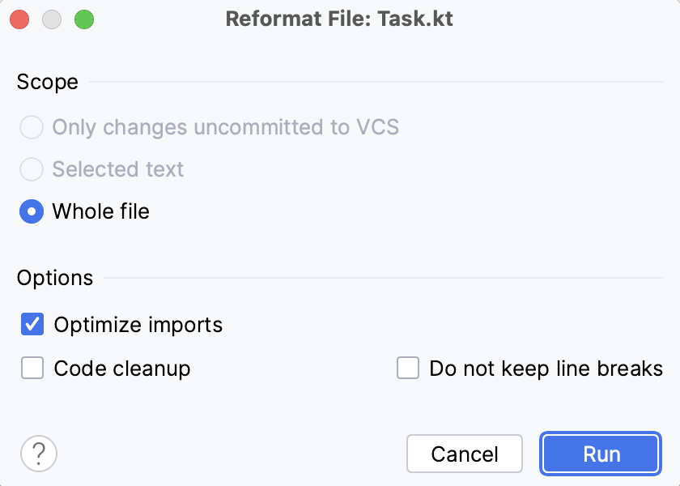

# Tarea 4/4: Reformatar el código usando el IDE

### Teoría

Para realizar cualquier refactorización en el IDE, puedes usar el Menú de Refactorización o un atajo específico. También es posible configurar atajos personalizados. Usa el atajo **&shortcut:ReformatCode;** (macOS) o **Ctrl + Alt + L** (Windows/Linux) para que el IDE reformatee automáticamente tu código. Puedes ejecutarlo en algún fragmento específico de código si primero lo seleccionas y luego escribes el atajo, pero también puedes ejecutarlo en todo el archivo.

Puedes especificar configuraciones de reformateo en el **diálogo de Reformateo**, el cual está disponible al presionar
**&shortcut:ShowReformatFileDialog;** (macOS) o el atajo `Ctrl+Alt+Shift+L` (Windows/Linux). En este diálogo, puedes especificar el alcance de los cambios de formato y seleccionar las opciones a aplicar:
- La opción **Optimizar importaciones** eliminará todos los importaciones no utilizadas en tu archivo. Alternativamente, puedes invocarla usando el atajo **&shortcut:OptimizeImports;** o **Ctrl+Alt+O** (Windows/Linux).
- La opción **Limpiar código** ejecuta inspecciones de limpieza de código.
- La opción **No mantener saltos de línea** reformatea los saltos de línea de acuerdo con la configuración del estilo de código.

    

### Tarea

En esta tarea, necesitas reformatear el fragmento de código proporcionado usando el atajo.

### Pistas

  Usa &shortcut:ReformatCode; (macOS) o Ctrl + Alt + L (Windows/Linux) para reformatear el código.

